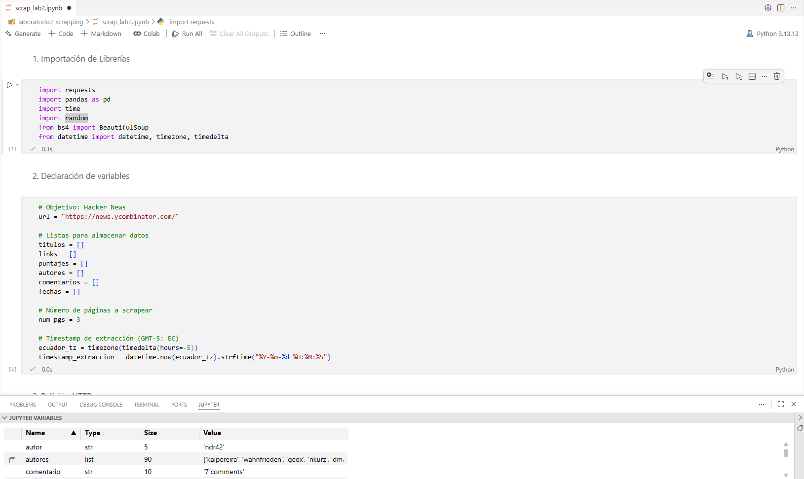
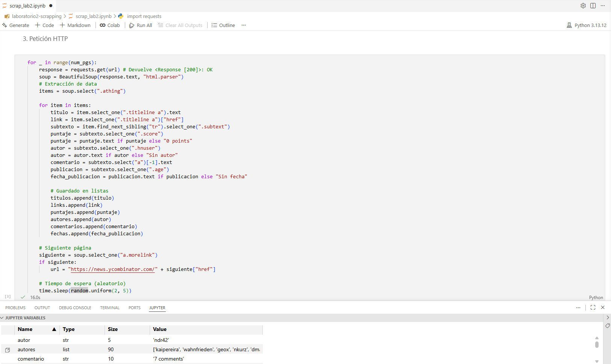
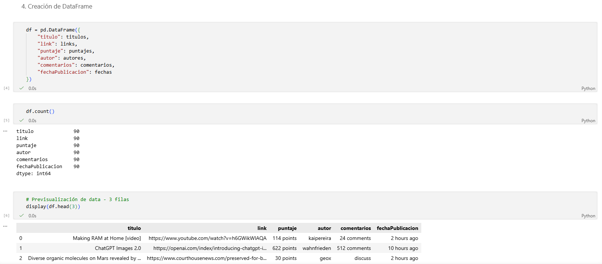
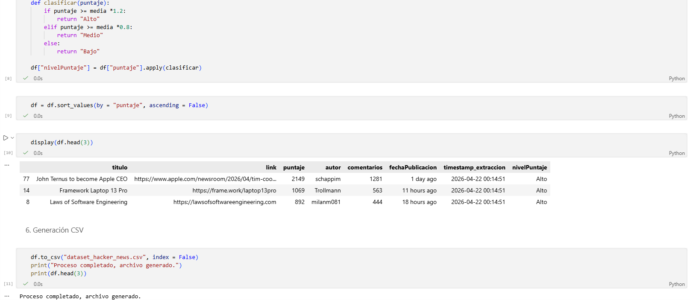
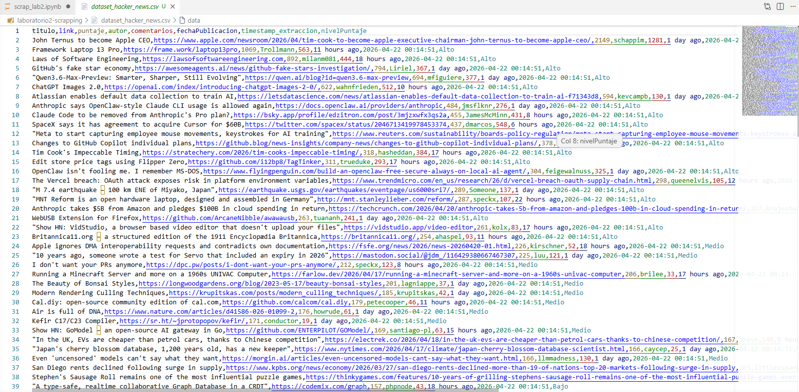

# 🕷️ Laboratorio 2: Web Scraping - Hacker News

## 📝 Descripción
Este proyecto implementa un sistema de extracción automatizada de datos desde la plataforma **Hacker News**. El objetivo es recopilar, limpiar y clasificar las noticias más relevantes para su análisis estadístico.

## ⚙️ Tecnologías Utilizadas
* **Lenguaje:** Python 3.x
* **Librerías:** * `requests` (Peticiones HTTP)
    * `BeautifulSoup4` (Parsing de HTML)
    * `Pandas` (Estructuración y limpieza de datos)
    * `random/time` (Gestión de pausas entre peticiones)

## 🚀 Flujo del Proceso (Evidencias)

### 1. Importación y Configuración
Se cargan las librerías necesarias y se definen las variables de entorno, incluyendo el tiempo de espera aleatorio para evitar bloqueos del servidor.

### 2. Petición HTTP y Extracción
Se recorren 3 páginas del sitio web, extrayendo títulos, enlaces, autores y puntajes.

### 3. Estructuración en DataFrame
La información recolectada en listas se convierte a un formato tabular usando la librería Pandas.

### 4. Limpieza y Clasificación
Se normalizan los datos numéricos y se aplica una función de clasificación que categoriza los puntajes en **Alto**, **Medio** o **Bajo** según la media aritmética.

### 5. Generación del Dataset Final
El proceso culmina con la exportación de los datos limpios a un archivo CSV.

## 📂 Resultado Final
El archivo generado se encuentra en la raíz del proyecto:
* **Archivo:** `dataset_hacker_news.csv`